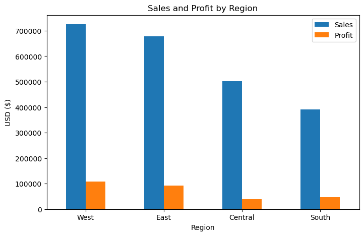
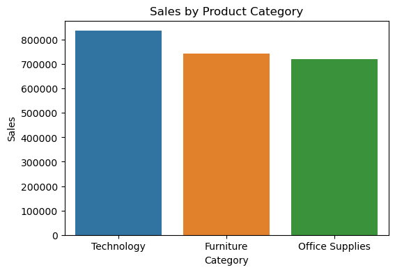
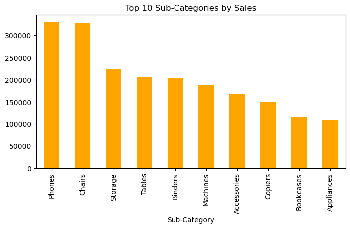
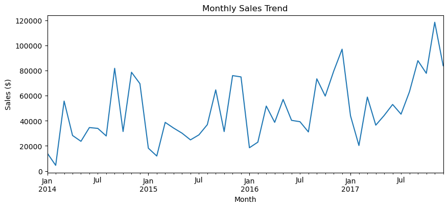
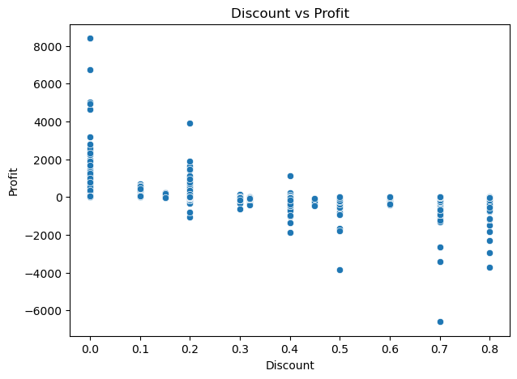
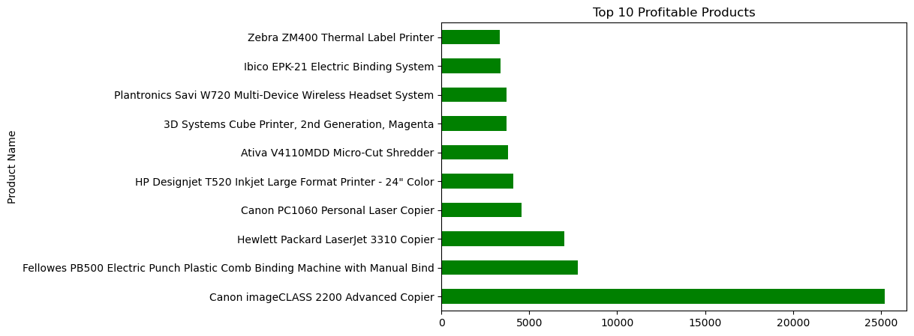

# Data_Analysis_Sales_Superstore

Dataset : https://www.kaggle.com/datasets/vivek468/superstore-dataset-final
Tool    : Python

key insight: 
    .1 Sales and Profit by Region 
    .2  Sales by product 
    .3  Top 10 Sub-Categories by Sales 
    .4  Monthly sales trends 
    .5  Discount vs Profit 
    .6  Top 10 Profitable trends 
    
 
 
 
 
 
 
